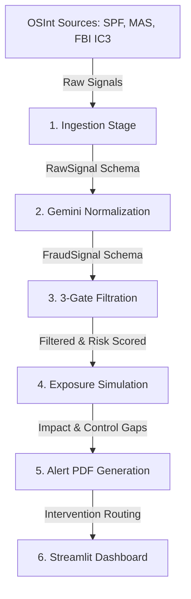

# 📡 Phantom Signal — OSInt Early Warning Framework

> **UOB Group Compliance · Innovation Challenge POC**  
> An automated, end-to-end early warning system that ingests open-source intelligence (OSInt), normalizes fraud signals using Gemini 1.5 Pro, scores risks, models customer exposure, and generates professional PDF Risk Alert Documents for proactive compliance intervention.

---

## 🏗️ System Architecture

Phantom Signal processes OSInt signals through a structured, multi-stage pipeline:



### Key Components

| Directory/File | Component Name | Description |
| :--- | :--- | :--- |
| [`app.py`](file:///c:/Users/agshi/Desktop/Anti%20Gravity/OSint/app.py) | **Main Entry Point** | Launches the Streamlit dashboard hosting the UI and orchestrator. |
| [`pages/`](file:///c:/Users/agshi/Desktop/Anti%20Gravity/OSint/pages) | **Dashboard Pages** | Individual tabs/views (Live Feed, Fraud Intelligence, Relevance Assessment, Alert Viewer, Demo Mode, Active Deception POC). |
| [`pipeline/`](file:///c:/Users/agshi/Desktop/Anti%20Gravity/OSint/pipeline) | **Data Pipeline** | Stages for Ingestion, Normalization, Filtration, Simulation, and Intervention. |
| [`data/`](file:///c:/Users/agshi/Desktop/Anti%20Gravity/OSint/data) | **Data & Storage** | Database wrappers (`database_sqlite.py`), seed generators, and raw assets. |
| [`utils/`](file:///c:/Users/agshi/Desktop/Anti%20Gravity/OSint/utils) | **Utilities** | PDF Report Generator and the Gemini API client interface. |
| [`config.py`](file:///c:/Users/agshi/Desktop/Anti%20Gravity/OSint/config.py) | **Configuration** | App settings, constants, and color palette definitions. |

---

## 🛠️ Features

* **AI-Powered Normalization**: Leverages `Gemini 1.5 Pro` to extract structured indicators from messy unstructured news, police advisories, and security alerts.
* **3-Gate Relevance Engine**: Checks signals for thematic relevance, geographic fit (focusing on Singapore/regional context), and temporal/novelty checks.
* **Simulation & Impact Modelling**: Simulates customer exposure across multiple personas (e.g., elderly, corporate, youth) using synthetic historical loss data.
* **Professional PDF PDF Reports**: Generates automated, branded, high-fidelity Risk Alert Documents with impact calculations, TM rule change recommendations, and intervention routing paths.
* **Interactive Streamlit UI**: A dark-mode, responsive operational console to visualize the pipeline live.

---

## 🚀 Setup & Local Installation

### Prerequisites

* Python 3.10+
* Git
* Gemini API Key (set up via Google AI Studio)

### Installation Steps

1. **Clone the Repository**
   ```bash
   git clone https://github.com/agshiv92/OSint.git
   cd OSint
   ```

2. **Configure Environment Variables**  
   Create a `.env` file in the root directory (this is automatically ignored by git to keep your keys safe):
   ```env
   GEMINI_API_KEY=your_gemini_api_key_here
   ```

3. **Install Dependencies**
   ```bash
   pip install -r requirements.txt
   ```

4. **Initialize & Seed the Database**  
   Run the application once, or use the db initializer to seed synthetic signals:
   ```bash
   python data/seed_data.py
   ```

5. **Run the Dashboard**
   ```bash
   streamlit run app.py
   ```

---

## 🔒 Security & Safe Commit Practices

* **Credentials**: The `.env` file and any Google/Firebase service account keys (`firebase_key.json`) are automatically ignored via `.gitignore` to prevent credential leaks.
* **Database**: Local SQLite databases (`*.db`, `*.sqlite`) are ignored so that development builds start with a clean or seeded state without bloating the repository.
